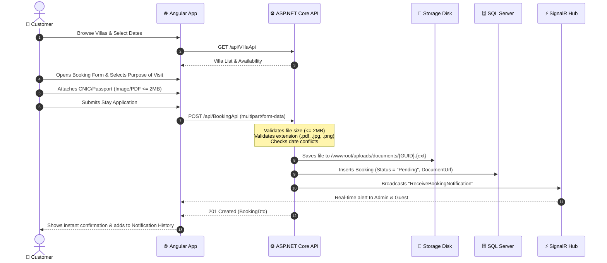
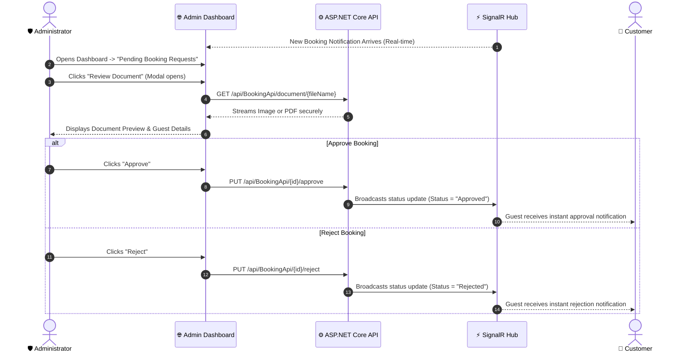
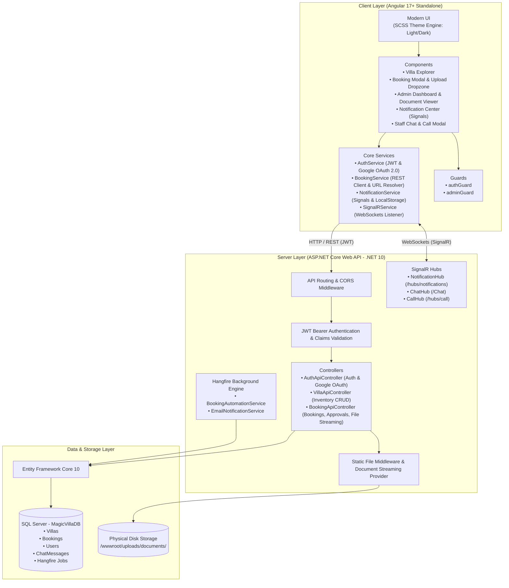
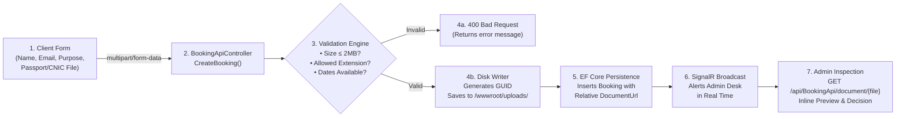
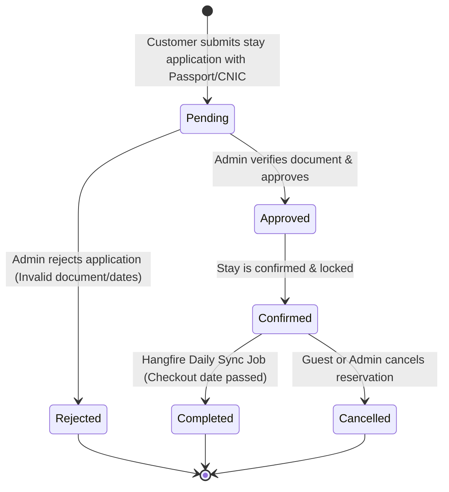
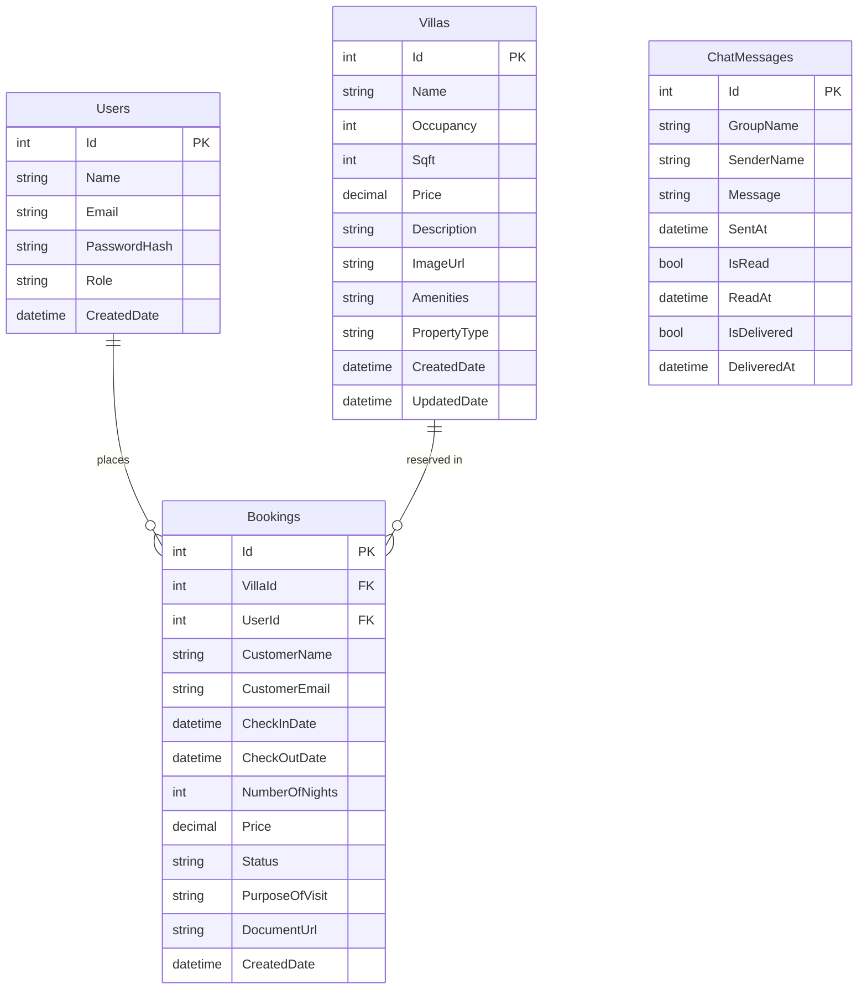

<div align="center">

# 🏡 MagicVilla
### Enterprise Luxury Villa & Resort Booking Management System

A modern, production-grade villa and resort booking platform built with **Angular 17+ (Standalone)** and **ASP.NET Core Web API (.NET 10)**.

[](https://dotnet.microsoft.com/)
[](https://learn.microsoft.com/dotnet/csharp/)
[](https://angular.dev/)
[](https://www.typescriptlang.org/)
[](https://dotnet.microsoft.com/apps/aspnet/signalr)
[](https://www.hangfire.io/)
[](https://www.microsoft.com/sql-server)
[](https://developers.google.com/identity)
[](#-license)

<br/>

**[Live Overview](#-project-overview)** • **[System Architecture](#-system-architecture)** • **[Document Verification Flow](#-document-upload--verification-flow)** • **[API Documentation](#-api-documentation)** • **[Setup Guide](#-installation--setup-instructions)**

---

</div>

## 📖 Project Overview

**MagicVilla** is an enterprise-tier full-stack hospitality reservation platform engineered to address real-world luxury property booking, guest identity verification, operational workflow management, and real-time communications.

Unlike basic CRUD demo applications, MagicVilla implements complete hospitality lifecycle operations:
1. **Interactive Guest Booking Experience**: Multi-category villa explorer, dynamic date calculation, conflict avoidance, and stay application submission.
2. **Customer Identity Verification Workflow**: Guests submit purpose of visit and upload government identification (CNIC or Passport in Image or PDF format $\le$ 2MB), which is validated, securely stored on disk, and routed to administrators.
3. **Administrative Command Center**: Real-time review queue with high-definition inline image previews and PDF viewers, enabling 1-click **Approve** or **Reject** stay applications with instant real-time SignalR notifications.
4. **Persistent Real-Time Notification Center**: A SignalR-powered notification bell utilizing Angular Signals and `localStorage` persistence, ensuring alerts, unread counts, and historical timestamps (`Just now`, `5m ago`) are never lost on page refresh.
5. **Multi-Channel Real-Time Communications**: Direct peer-to-peer **WebRTC audio calling** (`CallHub`) and synchronized multi-user **Staff Chat** (`ChatHub`) backed by SQL Server message persistence.
6. **Automated Background Engine**: **Hangfire** automation engine that continuously scans stay checkouts to transition bookings to `Completed` status and dispatches periodic summary reports.
7. **Dual Authentication**: Industrial JWT Bearer authentication paired with **Google OAuth 2.0 Single Sign-On** (`GoogleJsonWebSignature`) with automatic customer onboarding.

---

## 🌟 Key Features

### 🏨 1. Villa Catalog & Inventory Showcase
- **Category-Based Filtering**: Seamlessly filter listings by property type: `Villa`, `HotelRoom`, and `Apartment`.
- **Full-Text Search**: Live keyword search matching against property titles, descriptions, and amenities.
- **Rich Property Details**: High-resolution imagery, square footage, occupancy limits, nightly rates, and amenity badges.
- **Admin Inventory Controls**: Modal property creator, inline editor, and safe deletion protections with role verification.

### 📝 2. Customer Stay Application & Document Upload
- **Pre-Booking Stay Modal**: Guests enter their verified contact details and select their **Purpose of Visit** (`Holidays`, `Family Vacation`, `Party / Gathering`, `Business & Corporate`).
- **Identity Proof Dropzone**: Native upload component accepting **Passport** or **CNIC** documents:
  - Formats: `.jpg`, `.jpeg`, `.png`, `.webp`, and `.pdf`.
  - Client-side and server-side size enforcement ($\le$ 2MB).
  - Sanitized unique GUID naming with secure file storage.
- **Conflict Prevention**: Intelligent overlap engine that prevents double-booking and calculates the next available date if a property is occupied.

### 🛡️ 3. Administrative Review & Decision Workflow
- **"Action Required" Queue**: Prominent pending requests section on the Admin Dashboard displaying incoming reservations requiring review.
- **Built-in Document Inspector**:
  - Image documents: Rendered with high-definition zoom previews.
  - PDF documents: Integrated viewer with direct secure streaming.
- **1-Click Approvals & Rejections**: Administrators can instantly approve or reject reservations with optional audit notes.
- **Instant Guest Dispatch**: SignalR broadcasts immediate status changes back to the customer.

### 🔔 4. Persistent Real-Time Notification Center
- **Angular Signal Architecture**: Uses reactive signals (`signal`, `computed`) for unread counts and instantaneous badge updates.
- **Persistent LocalStorage Cache**: Notifications are automatically cached in `localStorage` (`mv_notifications_history`), keeping past alerts accessible across sessions.
- **Human-Readable Timestamps**: Formats alerts into intuitive intervals (`Just now`, `8m ago`, `2h ago`, `Oct 14`).
- **Interactive Controls**: Unread indicators, 1-click "Mark all read", individual item removal (✕), and full history wipe ("Clear all").
- **Deep Linking**: Clicking an alert immediately routes the user to the corresponding reservation record.

### 💬 5. Real-Time Staff Chat & 📞 WebRTC Audio Calling
- **Staff Live Chat (`/staff-chat`)**: SignalR `ChatHub` facilitating real-time messaging between front-desk staff and management with message delivery/read receipts persisted in SQL Server.
- **Direct Audio Calling**: WebRTC-signaled `CallHub` enabling voice communications between authorized staff members and the admin desk.

### 🔐 6. Dual Authentication & Role-Based Access Control
- **JWT Authentication**: HMAC-SHA256 tokens carrying claims for `UserId`, `Email`, `Name`, and `Role`.
- **Google OAuth 2.0**: Official Google Sign-In SDK integration validated via `GoogleJsonWebSignature` with automatic Customer account creation.
- **Role Guards**: Frontend `authGuard` and `adminGuard` protecting sensitive administrative interfaces.

### ⏱️ 7. Automated Background Engine (Hangfire)
- **Daily Booking Status Sync**: Background recurring job that inspects checkout dates and automatically marks expired stays as `Completed`.
- **Periodic Summary Reports**: Automated system telemetry and occupancy metrics.
- **Hangfire Dashboard**: Real-time server telemetry and job health monitoring at `/hangfire`.

### 🎨 8. Adaptive Dark / Light Mode Theme Engine
- Instant toggle with full CSS variable mapping across all components, modals, and dropdowns.
- Automatic persistence of user theme preferences in `localStorage`.

---

## 🔄 User & Admin Workflows

### 👤 Guest (Customer) Workflow



---

### 🛡️ Administrator Workflow



---

## 🏛️ System Architecture

MagicVilla is structured as a high-performance **Monorepo** with a clean separation of concerns:



---

## 📁 Document Upload & Verification Flow

The customer verification architecture is built for strict validation, storage safety, and seamless administrative inspection:



### Technical Implementation Details:
1. **Payload**: The client sends a `multipart/form-data` request containing booking attributes and the `IFormFile Document`.
2. **Security Controls**:
   - Extension whitelist: `.jpg`, `.jpeg`, `.png`, `.webp`, `.pdf`.
   - Size limitation: Strict binary ceiling of `2 * 1024 * 1024` bytes (2MB).
   - Filename sanitization: Original filenames are discarded; unique cryptographically secure GUIDs are assigned (`$"{Guid.NewGuid():N}{extension}"`).
3. **Dual Serving Strategy**:
   - Primary: High-speed static file serving via ASP.NET Core `UseStaticFiles` with `PhysicalFileProvider`.
   - Streaming Fallback: Dedicated controller endpoint `[HttpGet("document/{fileName}")]` returning `PhysicalFile(filePath, contentType)` to ensure reliable cross-platform streaming without web server MIME-type conflicts.

---

## 📊 Booking State Lifecycle



---

## 🗄️ Database Architecture

The application uses **Entity Framework Core 10 (Code-First)** with SQL Server.



### Database Entities Summary

| Table | Key Responsibilities | Relationships |
|---|---|---|
| **`Villas`** | Stores property inventory, pricing, amenities, and category tags (`Villa`, `HotelRoom`, `Apartment`). | One-to-Many with `Bookings`. |
| **`Bookings`** | Stores guest reservations, verification status, Purpose of Visit, and relative path to Passport/CNIC document. | Belongs to `Villa` (Cascade) and `User` (SetNull). |
| **`Users`** | Identity accounts, password hashes, and assigned roles (`Admin`, `Customer`). | One-to-Many with `Bookings`. |
| **`ChatMessages`** | Persists real-time communication messages for staff and guests with read/delivery timestamps. | Indexed on `(GroupName, SentAt)`. |
| **`Hangfire.*`** | Set of internal tables managing recurring background job states, locks, and history. | Managed by Hangfire SqlServer storage. |

---

## 🛠️ Technology Stack

### Backend Technologies

| Technology | Version | Purpose |
|---|---|---|
| **ASP.NET Core Web API** | `.NET 10.0` | Core RESTful server application |
| **C#** | `13.0` | Modern, strongly typed backend programming |
| **Entity Framework Core** | `10.0.11` | Object-Relational Mapper (ORM) |
| **Microsoft SQL Server** | `2019/2022` | Relational database management system |
| **Microsoft SignalR** | `10.0.11` | Full-duplex WebSocket communication hubs |
| **Hangfire** | `1.8.25` | Background automation job scheduler |
| **Google.Apis.Auth** | `1.76.0` | Cryptographic Google OAuth token validation |
| **BCrypt.Net-Next** | `4.0.3` | One-way salted password hashing |
| **Swashbuckle / OpenAPI** | `10.2.3` | Interactive Swagger API documentation |

### Frontend Technologies

| Technology | Version | Purpose |
|---|---|---|
| **Angular** | `22.1 / 17+` | Modern Standalone component SPA framework |
| **TypeScript** | `5.0+` | Type-safe client development |
| **Angular Signals** | `Built-in` | Reactive state management (`signal`, `computed`) |
| **RxJS** | `~7.8.0` | Asynchronous streams and reactive event handling |
| **@microsoft/signalr** | `^10.0.11` | Client-side WebSocket integration |
| **@abacritt/angularx-social-login**| `^2.6.0` | Official Google Sign-In SDK button & flow |
| **SCSS** | `Modular` | Custom component styling and dynamic theme engine |

---

## 📂 Project Structure

```
MagicVilla_Villa/
│
├── MagicVilla_VillaAPI/                     # ASP.NET Core Web API Project
│   ├── Controllers/                         # REST API Controllers
│   │   ├── AuthApiController.cs             # Register, Login, Google OAuth 2.0
│   │   ├── BookingApiController.cs          # Bookings CRUD, Approvals, File Streaming
│   │   └── VillaControllerApi.cs            # Villa Catalog CRUD & Filtering
│   ├── Data/
│   │   └── ApplicationDbContext.cs          # EF Core DbContext & Entity Configurations
│   ├── DTO/                                 # Data Transfer Objects
│   │   ├── AuthDto.cs                       # Login/Register requests & responses
│   │   ├── BookingDTO.cs                    # Booking DTOs (multipart/form-data creation)
│   │   └── VillaDto.cs                      # Property DTOs
│   ├── Hubs/                                # SignalR Real-Time Hubs
│   │   ├── NotificationHub.cs               # Live reservation alerts
│   │   ├── ChatHub.cs                       # Multi-user staff & guest chat
│   │   └── CallHub.cs                       # WebRTC audio calling signaling
│   ├── Migrations/                          # EF Core Code-First Migrations
│   ├── Models/                              # Domain Models
│   │   ├── Bookingcs.cs                     # Booking entity definition
│   │   ├── ChatMessage.cs                   # Chat message entity
│   │   ├── User.cs                          # User account entity
│   │   └── Villa.cs                         # Villa property entity
│   ├── Services/                            # Background Services
│   │   ├── BookingAutomationService.cs      # Hangfire checkout auto-sync
│   │   └── EmailNotificationService.cs      # Email alert dispatcher
│   ├── wwwroot/
│   │   └── uploads/documents/               # Secure disk storage for CNIC/Passports
│   ├── Program.cs                           # App startup, DI, CORS, SignalR mappings
│   └── appsettings.json                     # Environment configuration & secrets
│
├── Magic_villa_Frontend/                    # Angular Standalone Client Application
│   ├── src/app/
│   │   ├── components/                      # Standalone UI Components
│   │   │   ├── admin/admin-dashboard/       # Admin analytics & pending document review
│   │   │   ├── auth/register/login/         # Manual & Google Sign-In
│   │   │   ├── bookings/                    # Reservation list, filters, & preview modal
│   │   │   ├── home/                        # Landing page & hero showcase
│   │   │   ├── navbar/                      # Navigation, Notification Bell, Theme toggle
│   │   │   ├── staff-chat/                  # Real-time chat interface
│   │   │   ├── call-modal/                  # WebRTC audio calling popup
│   │   │   ├── toast/                       # On-screen toast notifications
│   │   │   ├── villa-list/                  # Villa explorer with category filters
│   │   │   ├── villa-details/               # Property details & stay application modal
│   │   │   ├── villa-create/                # Admin property creation form
│   │   │   └── villa-edit/                  # Admin property editor
│   │   ├── guards/                          # Route Security Guards
│   │   │   ├── auth.guards.ts               # Authenticated user guard
│   │   │   └── admin.guard.ts               # Administrator role guard
│   │   ├── services/                        # Client Services
│   │   │   ├── auth.service.ts              # Token storage & role verification
│   │   │   ├── booking.service.ts           # Bookings API client & document URL resolver
│   │   │   ├── notification.service.ts      # Signal-based persistent notification store
│   │   │   ├── signalr.service.ts           # SignalR connection & event listeners
│   │   │   ├── chat.ts                      # Chat hub client
│   │   │   ├── call.service.ts              # Audio calling WebRTC manager
│   │   │   ├── toast.service.ts             # Toast message queue
│   │   │   └── villa.service.ts             # Villa catalog API client
│   │   ├── app.config.ts                    # Providers, SocialAuth, HTTP client
│   │   ├── app.routes.ts                    # Application route definitions
│   │   └── app.ts                           # Root standalone shell
│   ├── angular.json
│   └── package.json
│
├── MagicVilla_Villa.slnx                    # Visual Studio Solution File
└── README.md                                # Project Documentation
```

---

## 📡 API Documentation

### 🔐 Authentication Endpoints (`/api/AuthApi` / `/api/UsersAuth`)

| Method | Route | Access | Request Body | Description |
|---|---|---|---|---|
| `POST` | `/api/AuthApi/register` | Public | `{ name, email, password }` | Registers a new Customer account with BCrypt hash. |
| `POST` | `/api/AuthApi/login` | Public | `{ email, password }` | Authenticates user; returns JWT token and role. |
| `POST` | `/api/AuthApi/google-login` | Public | `{ idToken }` | Validates Google OAuth token; auto-registers new users. |

### 🏨 Villa Catalog Endpoints (`/api/VillaApi`)

| Method | Route | Access | Query Parameters | Description |
|---|---|---|---|---|
| `GET` | `/api/VillaApi` | Public | `category`, `search` | Retrieves all villas with optional category & keyword search. |
| `GET` | `/api/VillaApi/{id}` | Public | None | Retrieves comprehensive details for a specific villa. |
| `POST` | `/api/VillaApi` | `Admin` | `VillaDto` | Creates a new villa property listing. |
| `PUT` | `/api/VillaApi/{id}` | `Admin` | `VillaDto` | Updates an existing villa's specifications or pricing. |
| `DELETE`| `/api/VillaApi/{id}` | `Admin` | None | Removes a villa from the platform. |

### 📅 Booking & Document Endpoints (`/api/BookingApi`)

| Method | Route | Access | Request Format | Description |
|---|---|---|---|---|
| `GET` | `/api/BookingApi` | `Admin` | None | Retrieves all reservations sorted newest first. |
| `GET` | `/api/BookingApi/my` | `Authorize` | None | Retrieves reservations belonging to the authenticated user. |
| `GET` | `/api/BookingApi/{id}` | `Authorize` | None | Retrieves a single booking record by ID. |
| `POST` | `/api/BookingApi` | `Authorize` | `multipart/form-data` | Submits stay application with Passport/CNIC document upload. |
| `PUT` | `/api/BookingApi/{id}/approve` | `Admin` | None | Approves a pending stay application. |
| `PUT` | `/api/BookingApi/{id}/reject` | `Admin` | `BookingStatusUpdateDto` | Rejects a stay application with optional review notes. |
| `GET` | `/api/BookingApi/document/{fileName}` | Public | None | Streams uploaded Passport/CNIC file directly from disk. |

### ⚡ SignalR Hub Routes

| Route | Protocol | Transports | Purpose |
|---|---|---|---|
| `/hubs/notifications` | WebSockets / SSE | Long Polling fallback | Real-time booking alerts & status broadcast. |
| `/Chat` | WebSockets / SSE | Long Polling fallback | Real-time staff & guest chat messaging. |
| `/hubs/call` | WebSockets / SSE | Long Polling fallback | Peer-to-peer WebRTC audio call signaling. |

---

## 🚀 Installation & Setup Instructions

### Prerequisites

Ensure the following tools are installed:
- [.NET 10.0 or .NET 9.0 SDK](https://dotnet.microsoft.com/download)
- [Node.js (v18.x or v20.x+) & npm](https://nodejs.org/)
- [Angular CLI](https://angular.dev/tools/cli) (`npm install -g @angular/cli`)
- SQL Server (LocalDB, Express, or Full Instance)

---

### 1. Clone the Repository

```bash
git clone https://github.com/syedsaimhaider78/MagicVilla_Villa.git
cd MagicVilla_Villa
```

---

### 2. Configure & Run Backend API

1. Navigate to the backend directory:
   ```bash
   cd MagicVilla_VillaAPI
   ```

2. Configure [`appsettings.json`](file:///E:/MagicVilla_Villa/MagicVilla_VillaAPI/appsettings.json):
   ```json
   {
     "ConnectionStrings": {
       "DefaultConnection": "Server=localhost;Database=MagicVillaDB;Trusted_Connection=True;TrustServerCertificate=True;"
     },
     "Jwt": {
       "Key": "MagicVillaUltraSecretSecurityKey2026ForAuthenticationApiSystem!"
     },
     "GoogleAuthSettings": {
       "ClientId": "YOUR_GOOGLE_CLIENT_ID.apps.googleusercontent.com"
     }
   }
   ```

3. Restore packages and update the database:
   ```bash
   dotnet restore
   dotnet ef database update
   ```

4. Run the API:
   ```bash
   dotnet run
   ```
   * Or open `MagicVilla_Villa.slnx` in **Visual Studio** and launch via IIS Express / Kestrel.
   * Default API base URL: `https://localhost:44373`
   * Swagger Documentation: `https://localhost:44373/swagger`
   * Hangfire Automation Dashboard: `https://localhost:44373/hangfire`

---

### 3. Configure & Run Angular Frontend

1. Open a new terminal in the frontend directory:
   ```bash
   cd Magic_villa_Frontend
   ```

2. Install dependencies:
   ```bash
   npm install
   ```

3. (Optional) Set your Google Client ID for Social Login in [`src/app/app.config.ts`](file:///E:/MagicVilla_Villa/Magic_villa_Frontend/src/app/app.config.ts):
   ```typescript
   id: 'YOUR_GOOGLE_CLIENT_ID.apps.googleusercontent.com'
   ```

4. Start the Angular development server:
   ```bash
   npm start
   # or: ng serve
   ```

5. Open your browser and visit:
   ```
   http://localhost:4200
   ```

---

## 🔑 Default Credentials

| Account Role | Email Address | Password | Permissions |
|---|---|---|---|
| **Administrator** | `admin@magicvilla.com` | `Admin@123` | Full dashboard access, pending document review, approvals/rejections, villa inventory CRUD. |
| **Customer** | *Self-register or Google Login* | *User defined* | Browse villas, submit stay applications, upload CNIC/Passport, view personal booking history. |

---

## 🔒 Security Considerations

1. **Cryptographic Identity Verification**: All protected endpoints enforce strict JWT Bearer validation with cryptographic HMAC-SHA256 signature verification and expiration tracking.
2. **File Upload Defensive Architecture**:
   - **Extension Whitelist**: Only `.jpg`, `.jpeg`, `.png`, `.webp`, and `.pdf` files are permitted.
   - **Byte-Size Ceiling**: Strictly caps uploads at 2MB to prevent denial-of-service storage exhaustion.
   - **Path Traversal Shield**: The API sanitizes input filenames using `Path.GetFileName()` and generates non-deterministic GUID identifiers before writing to disk.
   - **Isolation**: Static uploads are housed in isolated directories with script execution disabled.
3. **CORS Boundary Protection**: CORS policies strictly whitelist trusted origins (`http://localhost:4200` and `https://localhost:4200`) while allowing necessary credentialed SignalR handshakes.
4. **SQL Injection Immunity**: Database queries are executed strictly through Entity Framework Core parameterized query trees.
5. **Secure Password Storage**: Passwords are salted and hashed using `BCrypt.Net-Next`.

---

## 📸 Screenshots Showcase

| Experience | Preview Description |
|---|---|
| **Villa Explorer & Catalog** | Luxury villa cards with category pills (`Villa`, `HotelRoom`, `Apartment`), live keyword search, dynamic pricing, and occupancy metrics. |
| **Stay Application & Dropzone** | Pre-booking modal with Purpose of Visit selection and drag-and-drop CNIC / Passport attachment with real-time file preview. |
| **Admin Decision Command Center** | Action-required review queue featuring embedded high-resolution image viewer and PDF viewer with 1-click Approve / Reject buttons. |
| **Persistent Notification Dropdown** | Notification bell with unread badge counter, relative timestamps (`Just now`, `5m ago`), mark all read, and clear history options. |
| **Real-Time Staff Chat & Calling** | Collaborative staff communication panel powered by SignalR alongside direct WebRTC audio calling. |
| **Adaptive Dark Mode** | Complete high-contrast dark theme spanning all navigation, modal views, and admin analytics. |

---

## 🎓 Learning Outcomes & Concepts Demonstrated

This repository serves as a showcase of modern full-stack development practices:
- **Clean Architecture & Monorepo Management**: Structuring a cohesive full-stack repository with shared models and synchronized contracts.
- **Reactive Angular Architecture**: Harnessing modern Angular Standalone components, dependency injection via `inject()`, and reactive state management using **Angular Signals** (`signal`, `computed`).
- **Real-Time Distributed Event Systems**: Orchestrating WebSockets across multiple functional domains (instant alerts, live chat, audio signaling) using ASP.NET Core SignalR.
- **Enterprise Background Job Scheduling**: Implementing distributed, fault-tolerant background automation using **Hangfire** with SQL Server storage.
- **Cryptographic Third-Party Authentication**: Integrating official **Google OAuth 2.0** on both client and server with token validation and role mapping.
- **Production File Upload Pipelines**: Managing binary document streams, multi-format previews (Image & PDF), and storage security.

---

## 👤 Author

**Syed Saim Haider**  
Full-Stack Software Engineer · Specializing in ASP.NET Core & Angular

[](https://github.com/syedsaimhaider78)
[](https://linkedin.com/in/syed-saim-haider-030534411)
[](mailto:syedsaimhaider78@gmail.com)

---

## 📄 License

This project is licensed under the **MIT License**. See the [LICENSE](LICENSE) file for details.

<div align="center">
  <sub>Built with ❤️ by Syed Saim Haider. If you find this project valuable, please consider giving it a ⭐ on GitHub!</sub>
</div>
